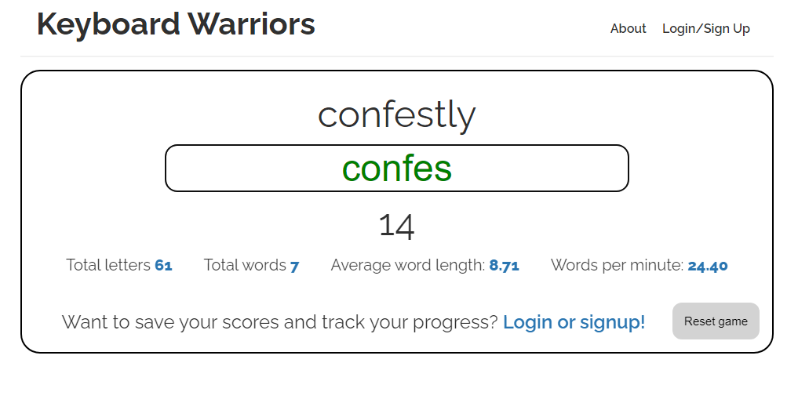
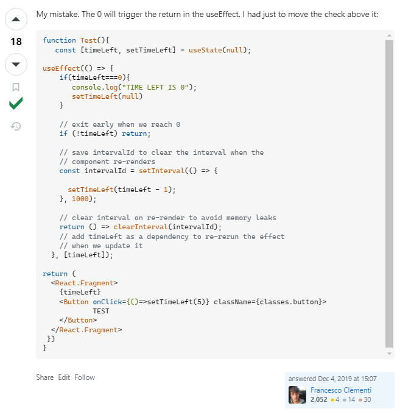
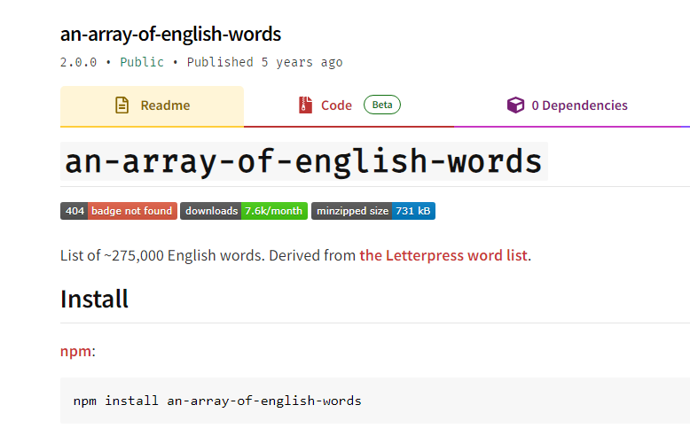

# Keyboard-Warriors

        
## Description
            
Keyboard Warriors is a responsive typing test which analyses a user's typing proficency and reaction speed.

The application is built using the complete MERN-stack (MongoDB back end, GraphQL API, Express.js & Node.js server, React front end) and utilises the npm package 'an-array-of-english-words'. 

I built this project as a fun way for users to practice their typing abilities while keeping track of their previous scores to assist with improvement. 

By completing this project, I now understand the nuances of how to translate front and back-end data through a MERN-stack environment.

### Screenshots of the deployed application:

- The application's typing game mechanic in action:

## Table of Contents
            
- [Installation](#installation)
- [Usage](#usage)
- [License](#license)
- [Contributing](#contributing)
- [Tests](#tests)
- [Questions](#questions)
            
## Installation

To install this application, you'll need to clone the repository to your local machine. [Refer to this guide from GitHub if you need help.](https://docs.github.com/en/repositories/creating-and-managing-repositories/cloning-a-repository/)

Once cloned, you will need to navigate to the project's folder in your terminal then add the project's dependencies and run the application. 

You can do both by entering the following on one line: `npm i; npm run develop`.
            
## Usage

To simply use the deployed application, visit a link to the website deployed on Render here:

- https://keyboardwarriors.site/

Otherwise, if you would prefer to host the application locally, follow the steps in [Installation](#installation). 
            
## License
            
MIT License

Copyright (c) 2024 isaacfallon
            
Permission is hereby granted, free of charge, to any person obtaining a copy
of this software and associated documentation files (the "Software"), to deal
in the Software without restriction, including without limitation the rights
to use, copy, modify, merge, publish, distribute, sublicense, and/or sell
copies of the Software, and to permit persons to whom the Software is
furnished to do so, subject to the following conditions:
            
The above copyright notice and this permission notice shall be included in all
copies or substantial portions of the Software.
            
THE SOFTWARE IS PROVIDED "AS IS", WITHOUT WARRANTY OF ANY KIND, EXPRESS OR
IMPLIED, INCLUDING BUT NOT LIMITED TO THE WARRANTIES OF MERCHANTABILITY,
FITNESS FOR A PARTICULAR PURPOSE AND NONINFRINGEMENT. IN NO EVENT SHALL THE
AUTHORS OR COPYRIGHT HOLDERS BE LIABLE FOR ANY CLAIM, DAMAGES OR OTHER
LIABILITY, WHETHER IN AN ACTION OF CONTRACT, TORT OR OTHERWISE, ARISING FROM,
OUT OF OR IN CONNECTION WITH THE SOFTWARE OR THE USE OR OTHER DEALINGS IN THE
SOFTWARE.
            
## Contributing

- To get the React countdown timer working properly, I referenced the following [Stack Overflow thread](https://stackoverflow.com/questions/59178634/react-5-seconds-countdown-with-hooks), with the answer provided by user Francesco Clementi serving as the inspiration for my implementation using React Hooks.

- To supply random words for the application, I utilised this public [npm package: 'an-array-of-english-words'](https://www.npmjs.com/package/an-array-of-english-words). 

            
## Tests

N/A
     
## Questions
            
If you have any questions, please reach out at either of the following:
            
### GitHub profile:
- https://github.com/isaacfallon

### Email:
- isaac.fallon@gmail.com
